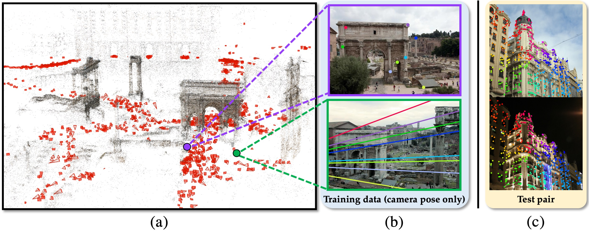

# Learning Feature Descriptors using Camera Pose Supervision

This repository contains a PyTorch implementation of the paper:

[*Learning Feature Descriptors using Camera Pose Supervision*](https://qianqianwang68.github.io/CAPS/)
[[Project page]](https://qianqianwang68.github.io/CAPS/)
[[Arxiv]](https://arxiv.org/abs/2004.13324)

[Qianqian Wang](https://www.cs.cornell.edu/~qqw/), 
[Xiaowei Zhou](http://www.cad.zju.edu.cn/home/xzhou/),
[Bharath Hariharan](http://home.bharathh.info/),
[Noah Snavely](http://www.cs.cornell.edu/~snavely/) 

ECCV 2020 (*Oral*)



## Abstract

Recent research on learned visual descriptors has shown promising improvements in correspondence estimation, a key component of many 3D vision tasks. However, existing descriptor learning frameworks typically require ground-truth correspondences between feature points for training, which are challenging to acquire at scale. In this paper we propose a novel weakly-supervised framework that can learn feature descriptors solely from relative camera poses between images. To do so, we devise both a new loss function that exploits the epipolar constraint given by camera poses, and a new model architecture that makes the whole pipeline differentiable and efficient. Because we no longer need pixel-level ground-truth correspondences, our framework opens up the possibility of training on much larger and more diverse datasets for better and unbiased descriptors. We call the resulting descriptors CAmera Pose Supervised, or CAPS, descriptors. Though trained with weak supervision, CAPS descriptors outperform even prior fully-supervised descriptors and achieve state-of-the-art performance on a variety of geometric tasks.


## Requirements
```bash
# Create conda environment with torch 1.0.1 and CUDA 10.0
conda env create -f environment.yml
conda activate caps
```
If you encounter problems with OpenCV, try to uninstall your current opencv packages and reinstall them again
```bash
pip uninstall opencv-python
pip uninstall opencv-contrib-python
pip install opencv-python==3.4.2.17
pip install opencv-contrib-python==3.4.2.17
```

## Pretrained Model
Pretrained model can be downloaded using this google drive [link](https://drive.google.com/file/d/1UVjtuhTDmlvvVuUlEq_M5oJVImQl6z1f/view?usp=sharing), or this BaiduYun [link](https://pan.baidu.com/s/1rGt4okK3KsumPLUVhOJdXQ) (password: 3na7).


## Dataset
Please download the preprocessed MegaDepth dataset using this google drive [link](https://drive.google.com/file/d/1-o4TRLx6qm8ehQevV7nExmVJXfMxj657/view?usp=sharing) or this BaiduYun [link](https://pan.baidu.com/s/1rGt4okK3KsumPLUVhOJdXQ) (password: 3na7

## Training
To start training, please download our [training data](https://drive.google.com/file/d/1-o4TRLx6qm8ehQevV7nExmVJXfMxj657/view?usp=sharing), and run the following command: 

```bash
# example usage
python train.py --config configs/train_megadepth.yaml
```


## Feature extraction
We provide code for extracting CAPS descriptors on HPatches dataset.
To download and use the HPatches Sequences, please refer to this [link](https://github.com/mihaidusmanu/d2-net/tree/master/hpatches_sequences).

To extract CAPS features on HPatches dataset, download the pretrained model, modify paths in ```configs/extract_features_hpatches.yaml``` and run
```bash
python extract_features.py --config configs/extract_features_hpatches.yaml
```

## Interactive demo
We provide an interactive demo where you could click on locations in the first image and see their predicted correspondences in the second image.
Please refer to ```jupyter/visualization.ipynb``` for more details.

## Cite
Please cite our work if you find it useful: 
```bibtex
@inproceedings{wang2020learning,
  Title = {Learning Feature Descriptors using Camera Pose Supervision},
  Author = {Qianqian Wang and Xiaowei Zhou and Bharath Hariharan and Noah Snavely},
  booktitle = {Proc. European Conference on Computer Vision (ECCV)},
  Year = {2020},
}
```
**Acknowledgements**. We thank Kai Zhang, Zixin Luo, Zhengqi Li for helpful discussion and comments. This work was partly supported by a DARPA
LwLL grant, and in part by the generosity of Eric and Wendy Schmidt by
recommendation of the Schmidt Futures program.
